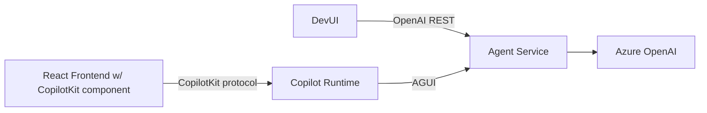
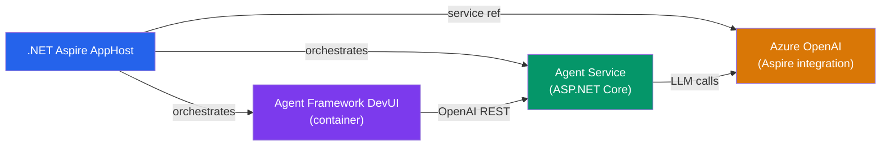
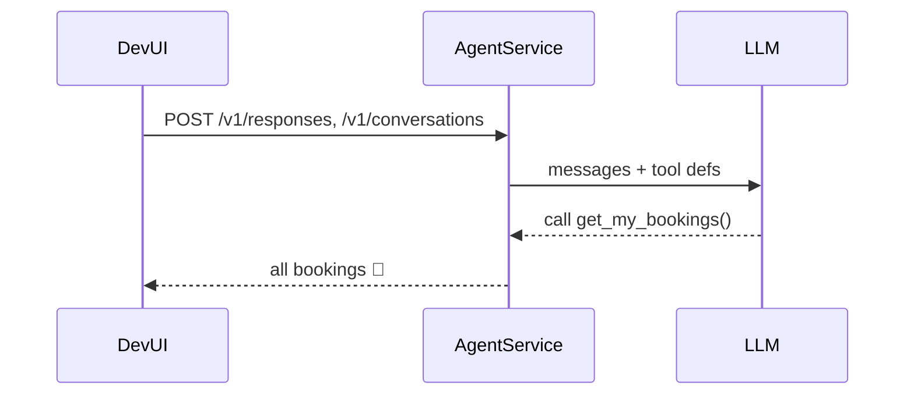
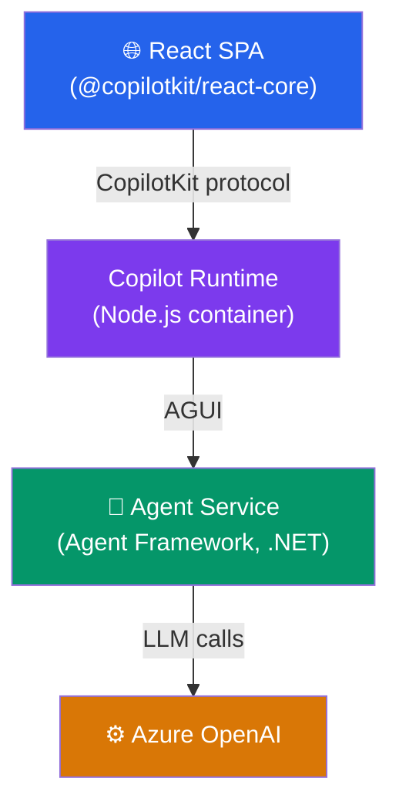
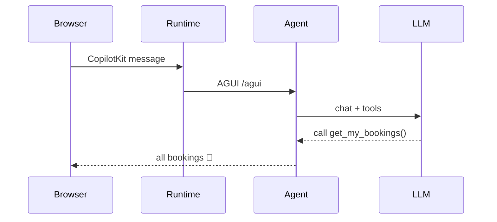
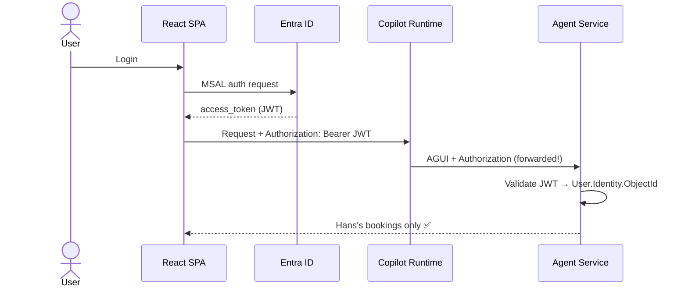
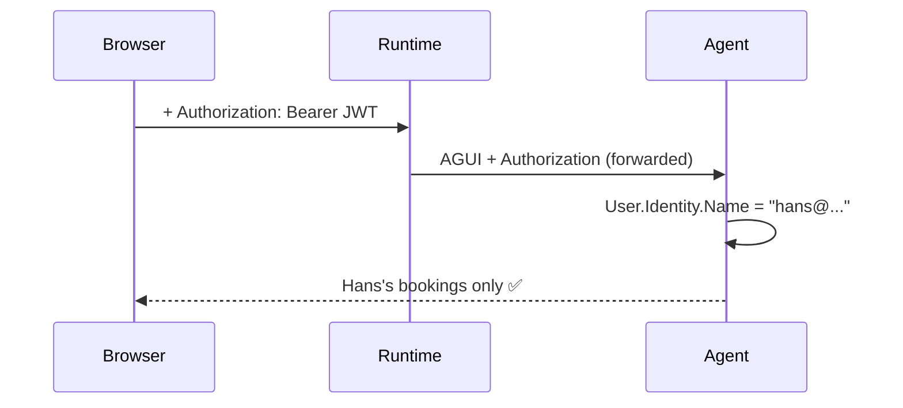
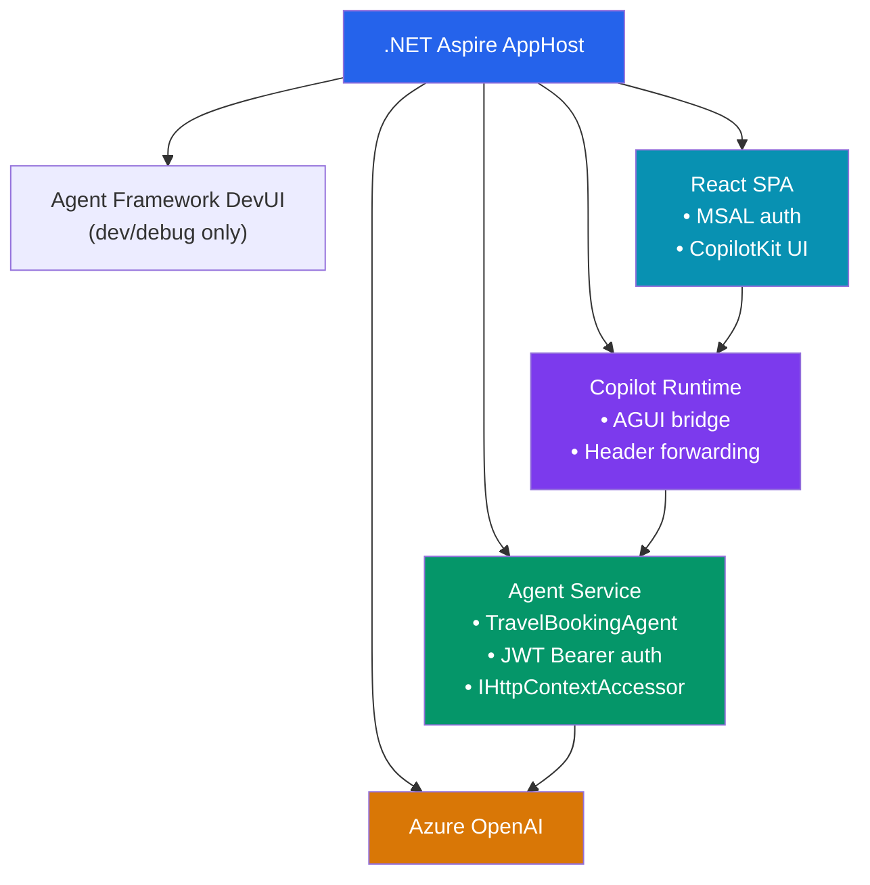

<div class="absolute top-10 left-5 bg-black/70 backdrop-blur-sm p-4 rounded-md">
  <div class="font-700">
    Hans Bakker
  </div>
  <div class="font-700">
    XKE · June 23rd 2026
  </div>
</div>

<div class="absolute bottom-5 left-5 bg-black/70 backdrop-blur-sm p-4 rounded-md">
  <h1>Authenticated Agents</h1>
  <p>CopilotKit + Microsoft Agent Framework in .NET</p>
</div>

<!--
Welcome! Today we look at how to pass the authenticated user context all the way into agent tool calls.
-->

---
hideInToc: true
transition: fade-out
---

# Why should your agent know *who* you are?

<v-clicks>

- **Personalization** → *"Your* upcoming trips, Hans"
- **Authorization** → *"You need manager approval to book business class"*
- **Accountability** → Audit trail: which user asked the agent to do what
- **Downstream APIs** → Call services *on behalf of* the user (OBO)

</v-clicks>

<v-click>

<div class="mt-8 p-4 rounded bg-blue-900 bg-opacity-40">

**Our anchor:** `GetMyBookings` — a tool that reads a data file and returns only **your** bookings based on the authenticated user

</div>

</v-click>

<!--
Start with "why". The interesting question isn't HOW to pass auth — it's WHY you need it.
Build up: simple personalization → access control → audit → OBO.
The anchor tool makes the demo concrete and relatable.
-->

---
hideInToc: true
transition: fade-out
layout: two-cols-header
---

# Today's Goals

::left::
<v-clicks>

- Build a simple agent with some tools
- Host it as a standard ASP.NET Core API
- Add a user-facing frontend with CopilotKit
- Add authentication and pass the user context into the agent tool

</v-clicks>

<v-click>

<div class="mt-8 p-4 rounded bg-green-900 bg-opacity-40">

By the end, you'll have **runnable code** you can fork and adapt to your own agents.

</div>

</v-click>

::right::


<style>
.two-cols-header {
  column-gap: 20px; /* Adjust the gap size as needed */
}
</style>

---
hideInToc: true
layout: two-cols
layoutClass: gap-12
---

# Agenda

::right::

<Toc minDepth="1" maxDepth="1" mt-4 />

<!--
Quick overview of what we'll cover.
The Toc auto-generates from the section headings.
-->

---
layout: section
---

# The Building Blocks

---
hideInToc: true
---

## Microsoft Agent Framework

<v-clicks>

- Successor to earlier Microsoft agent frameworks (Semantic Kernel, Autogen) — **open source**
- Available for **C# and Python** — we'll use C#
- Build standalone **agents** or compose them into **multi-agent orchestrations** and build **workflows**
- Rich integrations: Azure AI Foundry, memory, MCP tools, external APIs
- Can expose agents as standardized endpoints

</v-clicks>

<v-click>

```csharp
// Register the agent with a name and system prompt
var agent = builder.AddAIAgent(
    name: "TravelBookingAgent",
    instructions: "You are a helpful travel booking assistant.");

// Tool methods live in AgentTools — wired via AIFunctionFactory
agent.WithAITool(sp =>
    AIFunctionFactory.Create(
        sp.GetRequiredService<AgentTools>().GetDestinations));
```

</v-click>

<!--
OPTIONAL slide — skip fast if most of the audience already knows Agent Framework.
-->

---
hideInToc: true
layout: two-cols-header
layoutClass: gap-8
---

## DevUI

::left::
Agent Framework ships with **DevUI** — a browser-based tool for testing agents during development

::right::


---
hideInToc: true
layout: two-cols-header
layoutClass: gap-8
---

## CopilotKit

::left::
Allows building rich frontends for agents, targeted at an end-user audience. Integrates via the standardized Agent–User Interaction (AG-UI) protocol.

::right::


---
hideInToc: true
---

## Different protocols for different usecases (1/2)

<table class="w-full protocols-table">
  <thead>
    <tr>
      <th>Protocol</th>
      <th>Usecase</th>
      <th>Audience</th>
    </tr>
  </thead>
  <tbody>
    <tr :class="{ 'row-highlight': $clicks >= 1 }">
      <td>OpenAI-compatible REST endpoints</td>
      <td>Expose your agent as if it is a LLM</td>
      <td>🖥️ Any OpenAI-compatible client</td>
    </tr>
    <tr :class="{ 'row-highlight': $clicks >= 1 }">
      <td>Agent–User Interaction (AG-UI)</td>
      <td>Browser and apps</td>
      <td>👥 End users</td>
    </tr>
    <tr>
      <td>Model Context Protocol</td>
      <td>Offer rich context and tools</td>
      <td>🤖 Agents</td>
    </tr>
    <tr>
      <td>Agent-to-Agent (A2A)</td>
      <td>Remote multi-agent orchestrations</td>
      <td>🤖 Agents</td>
    </tr>
  </tbody>
</table>

<!-- Advances one click step without introducing visible content -->
<v-click>
  <span class="sr-only">Highlight top protocol rows</span>
</v-click>

<style>
.protocols-table tr.row-highlight {
  background: rgba(245, 158, 11, 0.22);
  box-shadow: inset 0 0 0 1px rgba(245, 158, 11, 0.7);
  transition: background 220ms ease, box-shadow 220ms ease;
}
</style>

---
hideInToc: true
---

## Different protocols for different usecases (2/2)

<div class="grid grid-cols-2 gap-8">
<div>

### OpenAI v1-compatible

DevUI and any OpenAI-compatible client can talk to the agent via these endpoints:
- `/v1/responses`
- `/v1/conversations`

</div>
<div>

### Agent–User Interaction (AG-UI) Protocol

- Integration in browser and apps
- Allows visual rendering of data, user interaction, and shared state
- Demos at https://dojo.ag-ui.com/microsoft-agent-framework-dotnet


</div>
</div>

<v-click>

<div class="flex justify-center mt-4">



</div>

</v-click>

<!--
Agent Framework exposes BOTH. DevUI uses the OpenAI endpoint (familiar, easy to test).
Copilot Runtime talks AGUI for richer streaming and UI rendering.
This is WHY we need Copilot Runtime — it speaks AGUI to the agent.
-->

---
hideInToc: true
layout: two-cols-header
---

## Dev Setup for basic agent



::left::

<v-clicks>

- **Aspire** manages service URLs, health checks, and telemetry in one place
- **Aspire Dashboard** gives unified traces — invaluable for debugging agent tool calls
- Secrets in `secrets.json` — never in source control

</v-clicks>


::right::

<<< @/snippets/apphost-frontend.cs#base {1-14|1|3-4|6-9|11-14|1-14}{lines:true,maxHeight:'420px'}

<!--
Aspire is the glue. Show the dashboard during the demo — traces from agent → OpenAI are gold.
Point out that service discovery means no hardcoded URLs anywhere.
The DevUI container is referenced by name; Aspire injects the agent service URL automatically.
-->

---
hideInToc: true
---

# Development hint: Agent Skills

<<< @/snippets/install-agent-skills.sh {lines:true}

_These commands add relevant Agent Skills to your workspace, so that your coding agent understands how to work with the libraries we'll use_

---
layout: section
---

# Building the Agent

---
hideInToc: true
---

## Agent Service: Program.cs

<<< @/snippets/agent-scaffold.cs {1-30|1-2|4-5|7-10|12-15|17-20|22-23|25-28|30}{lines:true,maxHeight:'420px'}

<!--
Walk through step by step:
- Lines 1-2: WebApplicationBuilder + AddServiceDefaults (Aspire OTel + health)
- Lines 4-5: AddOpenAIClient — picks up the "openai" connection from Aspire; AddChatClient wires the model deployment
- Lines 7-10: AddAGUI, AddOpenAIResponses, AddOpenAIConversations — protocol and OpenAI-compatible endpoint support
- Lines 12-15: AddAIAgent — register agent with name, instructions, and in-memory session store (isolation disabled for demo)
- Lines 17-20: AddTransient<AgentTools> + WithAITool — register tool class and wire GetMyBookings via AIFunctionFactory
- Lines 22-23: builder.Build() + MapDefaultEndpoints — build the pipeline, then expose Aspire health/telemetry endpoints
- Lines 25-28: MapOpenAIResponses + MapOpenAIConversations (DevUI) + MapAGUI (Copilot Runtime)
-->

---
hideInToc: true
---

## Sample tool: GetDestinations

<<< @/snippets/agent-tool.cs#destinations {lines:true}

<!--
Start simple — a static list of destinations.
Tests that the whole scaffold works: model receives tool definitions, calls the tool, returns results.
Live demo: open DevUI, ask "What destinations do you offer?" — it calls this tool.
Aspire traces: you can see the tool call span nested under the agent request span.
-->

---
hideInToc: true
layoutClass: gap-8
---

## Tool: GetMyBookings (anonymous)

<<< @/snippets/agent-tool.cs#anonymous {lines:true}

<v-click>

```json
[
  {
    "userId": "5441b521-335a-4fd6-958c-cced1ea0f804",
    "destination": "Amsterdam",
    "date": "2026-08-15"
  },
  {
    "userId": "ddefe175-d966-4053-b29f-8b43b47e536e",
    "destination": "Tokyo",
    "date": "2026-09-01"
  }
]
```

</v-click>

<!--
The problem: the tool returns ALL bookings regardless of who's asking.
Ask the audience: why is this a problem?
The fix is coming — but first let's see it in action.
-->

---
hideInToc: true
---

## Demo 1: Agent in DevUI

<div class="grid grid-cols-2 gap-8 mt-6">
<div>

**What to show:**

<v-clicks>

1. Aspire Dashboard — all services green
2. Open DevUI → start a conversation
3. Ask: *"What destinations do you offer?"*
4. Ask: *"Show me my bookings"* → returns ALL 😬
5. Aspire traces: see the LLM tool call spans

</v-clicks>
</div>
<div>



</div>
</div>

<!--
LIVE DEMO 1
Point out in traces: the LLM decided to call the tool, tool executed, result returned.
The "all bookings" problem is the setup for the rest of the talk.
Also show: Aspire dashboard trace spans — the agent call and the OpenAI call are both visible.
-->

---
layout: section
---

# CopilotKit Frontend

---
hideInToc: true
layout: two-cols-header
---

# CopilotKit Setup

::left::



::right:: 
## Why Copilot Runtime?

- The React SDK speaks **CopilotKit's own protocol** — not AGUI directly
- Copilot Runtime is the **protocol bridge**: CopilotKit ↔ AGUI
- Runtime **forwards authentication header** from browser to agent

<div class="mt-4 p-3 rounded text-sm bg-amber-900 bg-opacity-40">

⚠️ **Trusted backend only** — the AGUI endpoint should not be publicly exposed. The Copilot Runtime acts as the trusted intermediary between the browser and the agent.

</div>

<!--
The Runtime is the crucial missing piece.
It's what allows the browser auth token to reach the agent tool.
Without it, we'd need the browser to speak AGUI directly — complex and inflexible.
The Runtime is a lightweight Node.js container we run alongside the agent service.
-->

---
hideInToc: true
---

## Frontend setup

- Create an empty Vite React TypeScript project in the `frontend` folder:
  > npx create-vite@latest frontend -- --template react-ts

- Setup CopilotKit in App.tsx:
  <<< @/snippets/msal-copilotkit.tsx#anonymous {lines:true}

---
hideInToc: true
---

## Copilot Runtime code

<<< @/snippets/server.ts{1-60|8-10|18-29|33-51|53-60|1-60} {lines:true,maxHeight:'420px'}

---
hideInToc: true
---

## Add Runtime + SPA to Aspire

<<< @/snippets/apphost-frontend.cs#frontend {lines:true}

<!--
Walk through the AppHost additions:
- AddJavaScriptApp for the Copilot Runtime: a local Node.js project (not a container)
  - WithReference injects services__agentservice__http__0 so the runtime can reach the agent
  - The runtime's server.ts reads that env var and connects to /agui on the agent service
- AddViteApp for the React frontend: Aspire handles hot reload + port assignment
  - WithReference injects services__copilot-runtime__http__0 so the frontend knows the runtime URL
  - Fixed HTTPS port 7001 gives a predictable redirect URI to register in Entra ID
- WaitFor chains ensure correct startup order
-->

---
hideInToc: true
---

## Connect frontend to runtime

<<< @/snippets/vite.config.ts{lines:true}

<!--
Pre-built, walk through:
- CopilotKit wraps the app — provider pattern familiar from React Query, MSAL, etc.
- runtimeUrl comes from Vite env var (injected by Aspire)
- CopilotChat gives you a full chat UI in ~3 lines
- Or use useCopilotChat hook for a fully custom UI
-->

---
hideInToc: true
---

## Demo 2: Anonymous End-to-End

<div class="grid grid-cols-2 gap-8 mt-6">
<div>

**What to show:**

<v-clicks>

1. React SPA opens in browser
2. Ask: *"What destinations do you offer?"*
3. Ask: *"Show me my bookings"* → still all 😬
4. Aspire traces: Browser → Runtime → Agent → LLM

</v-clicks>
</div>
<div>



</div>
</div>

<!--
LIVE DEMO 2
Still returns all bookings — the anonymous problem persists.
Natural lead-in: "Let's fix this by adding authentication."
Show the Aspire trace: notice there is no Authorization header anywhere in the spans.
-->

---
layout: section
---

# Adding Authentication

---
hideInToc: true
---

## The Auth Architecture



<!--
The key insight: the JWT token flows from the browser all the way to the agent tool.
Two Entra app registrations: SPA (public client) + API (agent service).
The Runtime is the relay — it forwards the header without inspecting it.
The agent service validates the JWT using standard ASP.NET Core JWT Bearer middleware.
-->

---
hideInToc: true
layout: two-cols-header
layoutClass: gap-8
---

## Two Entra App Registrations

::left::

**SPA**

<v-clicks>

- Platform: **Single Page Application**
- Redirect URI: `http://localhost:PORT/`
- No client secret needed (public client)
- API Permission: `access_as_user` scope

</v-clicks>

::right::

**API (agent service)**

<v-clicks>

- Platform: **Web**
- Expose an API: `api://CLIENT_ID/access_as_user`
- App ID URI: `api://CLIENT_ID`
- Authorized client applications: the SPA app registration

</v-clicks>

<!--
Two registrations: one for the browser client, one for the protected API.
The SPA gets delegated access to the API via the "access_as_user" scope.
Pre-built — walk through the key config points, no live Entra portal work.
Emphasise: the SPA app reg trusts the API app reg explicitly.
-->

---
hideInToc: true
---

## Add MSAL to React

<<< @/snippets/msal-copilotkit.tsx#msal {lines:true}

<!--
Walk through:
1. MsalProvider wraps the app — configure with SPA client ID + tenant ID
2. acquireTokenSilent gets the access token for the API scope (cached, silent refresh)
3. The token is passed as Authorization header to CopilotKit
CopilotKit sends it to the Runtime, Runtime forwards it to the Agent Service.
The agent validates it with JWT Bearer middleware — standard ASP.NET Core.
-->

---
hideInToc: true
---

# Authentication

Copilot Runtime forwards the headers:

<<< @/snippets/server.ts#forward-headers {34-43} {lines:true,maxHeight:'420px'}

<!--
The header forwarding is done in server.ts, not via Aspire config.
When Express receives a request, it passes req.headers (including Authorization) directly
into the fetch Request sent to the Copilot Runtime handler.
The runtime handler then forwards those headers to the HttpAgent, which relays them to the agent service.
One highlighted line — but this is the critical link in the auth chain!
Without it, the JWT never reaches the agent.
-->

---
hideInToc: true
---

## Secure the Agent Service

<<< @/snippets/jwt-bearer.cs {1-53|20-22|24-32|45-51} {lines:true,maxHeight:'420px'}

<!--
LIVE CODE: Add these lines to Program.cs.
- Lines 2-4: AddAuthentication + AddMicrosoftIdentityWebApi — validate the JWT from Entra ID
- Lines 7-10: UseClaimsBasedSessionIsolation — per-user session store; also change .WithInMemorySessionStore(withIsolation: false) → .WithInMemorySessionStore()
- Lines 12-16: appsettings.json config (TenantId + ClientId — not secrets!)
- Lines 22-23: UseAuthentication + UseAuthorization — ASP.NET Core auth pipeline
- Line 26: RequireAuthorization() on the AGUI endpoint — reject unauthenticated requests with 401
-->

---
hideInToc: true
---

## Access the User in the Tool

<<< @/snippets/agent-tool.cs#authenticated {1-17|1-3|5-7|12,15|all}{lines:true}

<!--
LIVE CODE: Two additions from the anonymous version:
1. Lines 1-3: Add IServiceScopeFactory + IHttpContextAccessor to the constructor (DI)
2. Lines 5-7: GetCurrentUserId() reads the Entra object ID ("oid" claim) from the JWT
3. Lines 12, 15: Get the current user's ID and filter bookings to only theirs
User.GetObjectId() = the "oid" claim — stable across login sessions, unlike email.
IHttpContextAccessor is the bridge from the HTTP request context into the tool method.
Note: RequireAuthorization on the endpoint guarantees authentication before we get here.
-->

---
hideInToc: true
---

## Demo 3: Authenticated Bookings

<div class="grid grid-cols-2 gap-8 mt-6">
<div>

**What to show:**

<v-clicks>

1. Sign in via MSAL popup
2. Ask: *"Show me my bookings"*
3. Response: **only your bookings** ✅
4. Aspire trace: Authorization header visible in spans
5. Sign in as a different user → different bookings

</v-clicks>
</div>
<div>



</div>
</div>

<!--
LIVE DEMO 3 — the payoff!
Key moment: show that the response is filtered to the signed-in user.
Optional: show what happens with an expired/missing token (401 from agent service).
The Aspire trace now shows the Authorization header — visible in the request spans.
-->

---
hideInToc: true
layout: two-cols-header
---

## What We Built

::left::



::right::

<v-clicks>

- ✅ Development foundation with Aspire
- ✅ Frontend setup with CopilotKit
- ✅ Authenticated user context flows into every agent tool call

</v-clicks>

---
hideInToc: true
---

## What's Next?

<v-clicks>

- **OBO (On-Behalf-Of) flow** — call downstream APIs *with the user's token*
  ```csharp
  await _downstream.CallApiForUserAsync("BookingApi", "/reservations");
  ```

- **Fine-grained authorization** — gate specific tools or operations
  ```csharp
  if (!httpContext.User.IsInRole("Manager"))
      throw new UnauthorizedAccessException("Approval required");
  ```

- **User-scoped memory** — store agent state per user (`AIContextProvider`)

</v-clicks>

<!--
Leave them with clear next steps.
OBO is the natural follow-up for real enterprise scenarios — the user's token
gets exchanged for a token for a downstream API.
Point to the repo for the complete working code.
-->

---
hideInToc: true
layout: end
---

# Thanks!

<div class="grid grid-cols-2 gap-12 mt-10 text-left">
<div>

### Code & Slides
<mdi-github /> [hansmbakker/copilotkit-auth-e2e](https://github.com/hansmbakker/copilotkit-auth-e2e)

### CopilotKit
<mdi-web /> [docs.copilotkit.ai](https://docs.copilotkit.ai)

</div>
<div>

### Microsoft Agent Framework
<mdi-github /> [microsoft/agent-framework](https://github.com/microsoft/agent-framework)

</div>
</div>

<div class="mt-10 opacity-50 text-sm">
  Questions welcome!
</div>

<!--
Thank the audience. Point to the repo for the complete working code and slides.
-->
